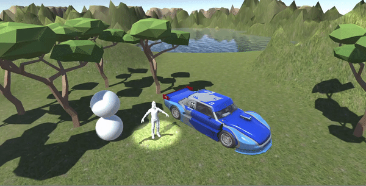

**Práctica 1 - Introducción a Unity**

Siguiendo el guión de la práctica punto por punto, en primer lugar colocamos los objetos 3D básicos, los cuales en nuestro caso escogí dos esferas que coloqué una encima de la otra utilizando las coordenadas x, y, z. Donde la única coordenada que se diferencia en ambos objetos es la del eje y, ya que de esta manera estarán en la misma posición pero a diferente altura.

En el siguiente punto procederemos a incluir en nuestro mini proyecto a un personaje llamado Ethan, el cual se encuentra en el paquete llamado _Standard Assets_ que lo encontraremos en la Asset Store. Tras descargarlo e importarlo al programa, insertamos a nuestro personaje en el plano en las coordenadas que queramos.

Tras realizar el paso anterior, el siguiente es repetir el mismo proceso, con la diferencia que escogimos un vehículo de otro paquete que descargamos e importamos desde la Asset Store. Dicho vehículo estaba en el paquete _Racing Touring Car Demo_. 

De la misma forma en la que añadimos los objetos 3D en el paso uno, en este punto añadimos un terreno que deformamos utilizando la herramienta de _Paint Terrain_ para generar pequeñas montañas que más adelante rodearán un lago. Por otra parte, a este terreno le dimos una textura de arena simulando una zona árida y justo por la zona que rodea el lago le dimos una textura más húmeda de color verde. Para ello tuvimos que escoger la opción de _Paint textures_ y cargar dichas texturas para luego poner la textura de arena en el fondo, y justo encima pintar las zonas escogidas del terreno con la segunda textura mediante la herramienta _Brush_.

A continuación, el punto que realizamos es el de etiquetar cada objeto del proyecto. Para llevar a cabo este punto seleccionamos cada objeto que tenemos en la lista de jerarquía y los etiquetamos en la pestaña _Tag_. De esta manera, agrupamos los objetos para que nos sea más fácil saber a qué pertenecen, por ejemplo, todos los árboles que añadimos pertenecen a la etiqueta de vegetación, los objetos básicos 3D pertenecen a la etiqueta de figuras geométricas, etc.

En el punto de iluminación solo tuvimos que añadir un punto de luz más, ya que el proyecto ya trae una luz direccional por defecto. Dicha luz que añadimos se trata de un foco de luz(spot light), el cual colocamos justo encima del personaje de Ethan para destacar su presencia.

Por último, añadimos un pequeño lago en el interior de las montañas, el cual se encontraba en el repositorio de _Standard Assets_, y para generar los árboles nos descargamos un nuevo paquete llamado _Low Poly Tree Pack_ de donde generamos los árboles y les añadimos texturas en armonía con la zona más húmeda del plano.

**Gif de la Práctica 1**

