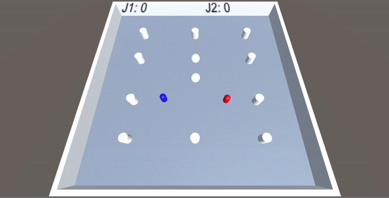

# Práctica 3 - Físicas en Unity

Para llevar a cabo esta práctica, la cual consta de tres apartados, hemos decidido generar un entorno que cuenta con un terreno limitado por objetos 3D que hacen la función de muro. De esta manera, los objetos que estén dentro del terreno desplazándose no se podrán salir en ningún momento.
Una vez tenemos nuestro entorno creado podemos dar paso a comenzar la práctica, la cual hemos dividido en tres apartados:

# Player

En este apartado se nos describe que el comportamiento del objeto Jugador debe poder detectar las colisiones que tenga con las Esferas que estén dentro de nuestro entorno para poder generar un contador de dichas colisiones. Además, debemos implementar el script correspondiente para que dicho objeto Jugador pueda desplazarse, mediante _Físicas_, con las teclas I, J, L y M en las distintas direcciones.

Script del objeto Jugador:

    using System;
    using System.Collections;
    using System.Collections.Generic;
    using System.Globalization;
    using UnityEngine;
    using UnityEngine.UI;

    public class Player : MonoBehaviour
    {
        public float moveSpeed = 10f;
        private Rigidbody rb;
        private float contador;
        public Text texto;
        // Start is called before the first frame update
        void Start()
        {
            this.GetComponent<Renderer>().material.SetColor("_Color", Color.blue);
            rb = this.GetComponent<Rigidbody>();
        }

        // Update is called once per frame
        void Update()
        {
            if (Input.GetKey(KeyCode.W))
            {
                rb.AddForce(Vector3.forward * moveSpeed);
            }

            if (Input.GetKey(KeyCode.S))
            {
                rb.AddForce(Vector3.back * moveSpeed);
            }

            if (Input.GetKey(KeyCode.A))
            {
                rb.AddForce(Vector3.left * moveSpeed);
            }

            if (Input.GetKey(KeyCode.D))
            {
                rb.AddForce(Vector3.right * moveSpeed);
            }
            SetDistance();
        }

        private void OnCollisionEnter(Collision collision)
        {
            if(collision.gameObject.tag == "Sphere")
                contador = contador + 1;

        }

        void SetDistance()
        {
            texto.text = "Contador: " + contador.ToString();
        }
    }
    
En primer lugar, para generar el movimiento del objeto Jugador mediante físicas utilizaremos la función _AddForce()_. Para ello, primero debemos proporcionarle un _Rigidbody_ al objeto desde la interfaz de Unity para poder manipularlo desde el script. Tras realizar ese paso, hemos generado un objeto _Rigidbody_ en el cual hemos guardado el _Rigidbody_ del objeto Jugador. A continuación, hemos generado una serie de _If_ para que el objeto se pueda mover en las diferentes direcciones dependiendo de las teclas que pulse el usuario. Por ejemplo, si el jugador pulsa la tecla W, se le aplicará una fuerza al _Rigidbody_ con la función _AddForce()_ para que en este caso avance en la dirección positiva del eje Z, mediante el uso de _Vector3.forward_ y de una variable que utilizamos como regulador de velocidad del desplazamiento, _moveSpeed_.

En segundo lugar, generaremos el contador de colisiones con las Esferas. Para ello, lo primero que debemos hacer es hacer uso de la función _OnCollisionEnter(Collision collision)_ para que el motor detecte cuándo el objeto Jugador entra en colisión con otro objeto. Para poder especificar que solo queremos que detecte cuando el jugador colisione con una esfera, debemos asignar a los objetos Esfera de nuestro entorno un "Tag" para clasificarlos y que nos sea más fácil de referenciar. Por lo tanto, cuando colisionamos con una Esfera, el objeto _Collision_ accede al _gameObject_ con el que colisionó y que nos devuelva el "tag" con el que está referenciado. Así, si dicho "tag" coincide con el que hemos especificado nosotros, incrementará una unidad en el contador. 

Para terminar este apartado, el contador que hemos generado lo podremos visualizar mientras el juego se está ejecutando, ya que hemos añadido un _Canvas_ o también conocido como "lienzo" para que siempre se vea en pantalla independientemente de lo que se sitúe en el trasfondo. Como hijo de dicho _Canvas_ hemos generado un _Text_ para que muestre el contador en una esquina de la pantalla. Para poder llevar a cabo dicha tarea, debemos volver al script y generar una función auxiliar que transforme el contador a tipo _String_ y así se pueda asignar al _Text_ del _Canvas_.

Por último, en la función _Start()_, añadimos una línea para cambiar el color de nuestro objeto Jugador a azul, para que se diferencie del resto de nuestro entorno.

# Esferas

El comportamiento de estos objetos está bastante claro, una de las esferas debe permanecer fija, y otra debe generar un movimiento aleatorio, mediante físicas, que recorra el entorno en cualquier dirección.
Con la esfera fija, simplemente debemos fijarla en unas coordenadas y añadirle un _Rigidbody_ para que no puedan desplazarla cuando choquen con ella.

Script del comportamiento de las Esferas:

    using System.Collections;
    using System.Collections.Generic;
    using UnityEngine;

    public class Rodar : MonoBehaviour
    {
        public GameObject esfera1;
        private Rigidbody rb;
        public float speed;

        private Vector3 NewPosition;
        public float TimeRandom = 1f;
        public float x_;
        public float z_;
        // Start is called before the first frame update
        void Start()
        {
            rb = esfera1.GetComponent<Rigidbody>();
        }

        // Update is called once per frame
        void Update()
        {
            TimeRandom -= Time.deltaTime;
            if(TimeRandom <= 0)
            {
                MoveRandom();
                TimeRandom = Random.Range(2f, 4f);
            }
        }

        void MoveRandom()
        {
            x_ = Random.Range(-10f, 10f);
            z_ = Random.Range(-10f, 10f);
            NewPosition = new Vector3(x_, 0, z_);
            rb.velocity = NewPosition * speed;
        }
    }

Sin embargo, con la esfera que no es estática, debemos realizar unos pasos más complejos. En primer lugar, declaramos un contador que hará de temporizador para que cuando dicho temporizador llegue a 0, la esfera cambie de dirección de desplazamiento. En la función _Update()_, vamos descontando el valor por defecto del temporizador con ayuda de _Time.deltaTime_, y cuando el valor llega a 0, realiza una llamada a la rutina _MoveRandom()_. En dicha rutina, lo primero que se hace es generar dos números aleatorios, ambos entre un valor positivo y otro negativo, que utilizaremos como coordenada X y Z para generar la nueva posición mediante un _Vector3_. Cuando ya tenemos la nueva posición, debemos utilizar el método _velocity_ que pertenece al _Rigidbody_ del objeto y establecerle la nueva dirección en la que debe desplazarse junto con un multiplicador de velocidad. 

Por último, cuando termina de ejecutarse la rutina, se actualiza de nuevo el temporizador para que vuelva a repetirse el ciclo.

# Cilindros
En este paso se nos encomienda la tarea de generar cilindros por todo el entorno de manera que actúen como sensores, es decir, cuando una esfera o el objeto Jugador se acerque a uno de ellos, deben cambiar de color a modo de alerta, cuando alguno de estos objetos entra en contacto con ellos debe mostrarse otro color, y por último, cuando el objeto sale de la colisión con el cilindro debe mostrarse un nuevo color.

Script de comportamiento de los Cilindros:

        using System.Collections;
        using System.Collections.Generic;
        using System.Threading;
        using UnityEngine;

        public class Cilindros : MonoBehaviour
        {
            private Renderer re;
            // Start is called before the first frame update
            void Start()
            {

            }

            // Update is called once per frame
            void Update()
            {
                re = GetComponent<Renderer>();

            }

            private void OnTriggerEnter(Collider col)
            {
                if(col.gameObject.tag == "Sphere" || col.gameObject.tag == "Player")
                {
                    re.material.SetColor("_Color", Color.yellow);
                }    
            }
            private void OnTriggerExit(Collider col)
            {
                if (col.gameObject.tag == "Sphere" || col.gameObject.tag == "Player")
                {
                    re.material.SetColor("_Color", Color.white);
                }
            }
            private void OnCollisionStay(Collision collision)
            {
                re.material.SetColor("_Color", Color.red);

            }
            private void OnCollisionExit(Collision collision)
            {
                re.material.SetColor("_Color", Color.green);
            }
        }

Lo primero que debemos hacer es obtener el _Renderer_ del objeto mediante la función _GetComponent<Renderer>()_, para así poder cambiar el color del objeto en las diferentes situaciones. Para ello, haremos uso de las funciones _OnCollisionStay(Collision collision)_ y de la función _OnCollisionExit(Collision collision)_. Esto significa que cuando un objeto se mantiene en colisión o sale de ella con nuestros cilindros, se cambiarán de color gracias a la función _SetColor()_.

Sin embargo, para que el cilindro cambie de color cuando un objeto entre en colisión con él, utilizaremos la función _OnTriggerEnter(Collider col)_. Para que el cilindro detecte con cierta anterioridad que un objeto está cerca de él hemos generado un nuevo Collider de forma cúbica que cubra al cilindro en un área. Cuando un objeto entra en dicho Collider, el cual debe tener la opción "isTrigger" activada, el programa lo detecta pero no choca contra él, simplemente lo traspasa y cambia de color nuestro cilindro en modo de advertencia. Para identificar que los objetos que entran en colisión son las esferas o el jugador, se declara de la misma forma de antes, mediante el "tag" o también podría ser con el "name" del propio objeto.

Finalmente, hemos utilizado la función _OnTriggerExit(Collider col)_ de modo que cuando los objetos hayan salido de la colisión, el cilindro vuelva a obtener su color por defecto, en nuestro caso, el blanco.

# Segundo Player

En el último apartado de la práctica se nos encomienda generar un objeto que actúe de la misma manera que el objeto Jugador, pero que se desplace con las teclas I,J,L,M. Para ello, simplemente hemos copiado el objeto Jugador y le hemos incluido una copia del script que hemos visto en el primer apartado, pero cambiando las teclas de desplazamiento y el color que queremos que tenga nuestro nuevo objeto, en este caso será rojo.

Por lo tanto, para el completo desarrollo de la práctica hemos programado cuatro scritps.
# Gif de la Práctica

